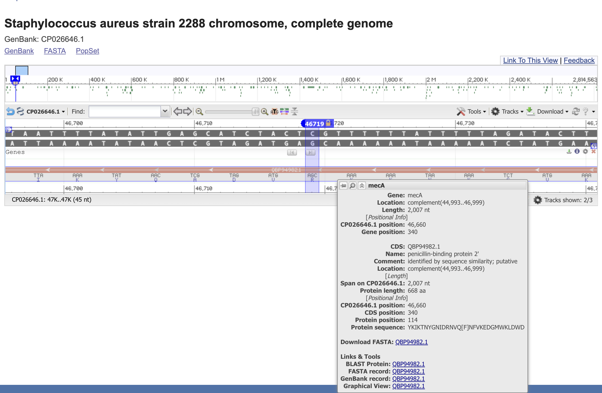

+++
using Dates
date = Date("2026-03-15")
title = "BLAST"
rss_descr = "Using NCBIBlast.jl to run BLAST searches"
+++

# Introduction to BLAST
A BLAST search allows you to query a sequence (either nucleotide or protein) against an entire database of sequences. 
It can be helpful for quickly compare unknown sequences to databases of established reference sequences for purposes such as species identity or assignment gene function.   

More information about how to use BLAST can be found in its [manual](https://www.ncbi.nlm.nih.gov/books/NBK569856/).  

BLAST searches can be run from the command line interface (CLI) or through BLAST web page [here](https://blast.ncbi.nlm.nih.gov/Blast.cgi).  
A user can simply copy in a nucleotide sequence and search for the best match in NCBI! 
While searching from the website is fast and straightforward,   
it only searches against the NCBI databases.    
The CLI allows users to query against both NCBI databases and custom databases.  

`NCBIBlast.jl` is a thin wrapper around the BLAST command line tool, 
allowing users to run the tool within Julia.  
The following BLAST tools are supported by `NCBIBlast`:
- `blastn`
- `blastp`
- `tblastn`
- `blastx`
- `makeblastdb`


Note: [BioTools BLAST](https://biojulia.dev/BioTools.jl/stable/blast/) is a deprecated Julia package for running BLAST searches and is different from `NCBIBLAST`.  


# How NCBIBlast.jl works


The keywords used in the tool are sent to the shell for running BLAST.  

As stated on the GitHub [docs](https://github.com/BioJulia/NCBIBlast.jl), the Julia call

```
blastn(; query = "a_file.txt", db="mydb", out="results.txt")
```

is sent to the shell as

```
$ blastn -query a_file.txt -db mydb -out results.txt
```

# BLAST databases
Having a BLAST database is necessary to run BLAST locally.    
A BLAST database is constructed from FASTA files that serve as reference sequences.   
A database can be built using the following command:  
```
makeblastdb(; in="test/example_files/dna2.fasta", dbtype="nucl")
```

More directions on building a BLAST database locally can be found [here](https://www.ncbi.nlm.nih.gov/books/NBK569841/).  

## Example: Building a local BLAST database and running the BLAST search

For our first example, we will replicate the example on the `NCBIBlast.jl` Github.  

First, we will build a local database using a FASTA file found in the NCBIBlast github repository ([link here](https://github.com/BioJulia/NCBIBlast.jl/blob/main/test/example_files/dna2.fasta)).  

```
makeblastdb(; in="assets/dna2.fasta", dbtype="nucl")

Building a new DB, current time: 03/16/2026 21:04:36
New DB name:   /Users/pintorson/Documents/tufts_bonham/daniellepinto/Projects/BioJulia/BioTutorials/cookbook/assets/dna2.fasta
New DB title:  assets/dna2.fasta
Sequence type: Nucleotide
Keep MBits: T
Maximum file size: 3000000000B
Adding sequences from FASTA; added 2 sequences in 0.0012269 seconds.


Process(`/Users/pintorson/.julia/artifacts/0406b91031ce302fa9117606d007d04635279fef/ncbi-blast-2.16.0+/bin/makeblastdb -in assets/dna2.fasta -dbtype nucl`, ProcessExited(0))
```
A new database was built in `assets`.

Now, we can define our query sequence.  
We can save the query string in memory (using IOBuffer) rather than reading in a FASTA file. 

```
buf = IOBuffer("TTACCTGCCGTGAGTAAATTAAAATTTTATTGACTTAG")
```

Now, we can run the BLAST search.  
The BLAST output format "6" means that the output will be tab-delimited text with no column names.  

The BLAST output will be written into IO.  
```
io = IOBuffer();
blastn(buf; stdout=io, db="assets/dna2.fasta", outfmt="6");
seek(io, 0);
```
The command `seek(io,0)` moves the cursor to the start of the captured object (index 0) so it can be read into a dataframe.  


```
using CSV, DataFrames
CSV.read(io, DataFrame; header=false)

1×12 DataFrame
 Row │ Column1  Column2  Column3  Column4  Column5  Column6  Column7  Column8  Column9  Column10  Column11  Column12 
     │ String7  String7  Float64  Int64    Int64    Int64    Int64    Int64    Int64    Int64     Float64   Float64  
─────┼───────────────────────────────────────────────────────────────────────────────────────────────────────────────
   1 │ Query_1  Test1      100.0       38        0        0        1       38       82       119  5.64e-18      71.3
```

### Interpreting BLAST Output
This output tells us that the query sequence (`Query_1` is the default name since we didn't specify a name) matches `Test1` in the reference database. 
There is 100% identity on a region that is 38 nucleotides long. 
There are 0 mismatches or gap openings.  
The match starts at index 1 on the query sequence, and ends at index 82.
This region matches a region in the `Test1` sequence spanning from index 82 to 119.  
The E-value is `5.64e-18`, meaning that it is extremely unlikely that this match occurred simply due to chance.  

Here is a description of the E-value from the NCBI [website](https://blast.ncbi.nlm.nih.gov/doc/blast-help/FAQ.html):
> The Expect value (E) is a parameter that describes the number of 
> hits one can “expect” to see by chance when searching a database of
> a particular size. It decreases exponentially as the Score (S) of 
> the match increases. 
> The lower the E-value the more “significant” the match is. However
> keep in mind that virtually identical short alignments have 
> relatively high E values. This is because the calculation of the E
> value takes into account the length of the query sequence. These 
> high E values make sense because shorter sequences have a higher 
> probability of occurring in the database purely by chance. 


The bitscore is 71.3.  

Here is a definition of bitscore from the NCBI BLAST [glossary](https://www.ncbi.nlm.nih.gov/books/NBK62051/):
> The bit score, S', is derived from the raw alignment score, S, 
> taking the statistical properties of the scoring system into account. 
> Because bit scores are normalized with respect to the scoring system, they
> can be used to compare alignment scores from different searches.


## Example: BLASTing the _mecA1_ gene against all of NCBI
Now that we've tried BLASTing against a local database,   
let's try BLASTing a piece of the _mecA_ gene against NCBI.  
To create the query file `mecA_BLAST.fasta`,   
I randomly selected 140 nucleotides from `mecA.fasta`.  

We should see that the query fasta is a direct hit to the _mecA_ gene  
(specifically to the sequence upload that we pulled from NCBI).  

For this BLAST search, I will search against the `core_nt` database, 
which is a faster, smaller, and more focused subset of the traditional `nt` (nucleotide) database.  
This newer database is the default as of August 2024.    
It seeks to reduce redundancy and storage requirements when downloading the database.      
More information about it can be found [here](https://ncbiinsights.ncbi.nlm.nih.gov/2024/07/18/new-blast-core-nucleotide-database/).    

General information about the different kinds of BLAST databases is also available [here](https://www.nlm.nih.gov/ncbi/workshops/2023-08_BLAST_evol/databases.html).  

```
io = IOBuffer();
blastn("assets/mecA_BLAST.fasta"; db="core_nt", stdout=io, remote=true, outfmt="6 query subject expect")
seek(io, 0);
CSV.read(io, DataFrame; header=false)
```

Here is the output of the BLAST.  

```
julia> CSV.read(io, DataFrame; header=false)
500×12 DataFrame
 Row │ Column1     Column2     Column3  Column4  Column5  Column6  Column7  Column8  Column9  Column10  Column11  Column12 
     │ String15    String15    Float64  Int64    Int64    Int64    Int64    Int64    Int64    Int64     Float64   Int64    
─────┼─────────────────────────────────────────────────────────────────────────────────────────────────────────────────────
   1 │ mecA_BLAST  CP026646.1    100.0      140        0        0        1      140    46719     46580  7.12e-65       259
   2 │ mecA_BLAST  CP154497.1    100.0      140        0        0        1      140    45702     45563  7.12e-65       259
   3 │ mecA_BLAST  CP049499.1    100.0      140        0        0        1      140    61014     60875  7.12e-65       259
   4 │ mecA_BLAST  CP030403.1    100.0      140        0        0        1      140    48633     48494  7.12e-65       259
   5 │ mecA_BLAST  CP132494.1    100.0      140        0        0        1      140  1867742   1867603  7.12e-65       259
   6 │ mecA_BLAST  MH798864.1    100.0      140        0        0        1      140      281       420  7.12e-65       259
   7 │ mecA_BLAST  CP162442.1    100.0      140        0        0        1      140   503005    503144  7.12e-65       259
   8 │ mecA_BLAST  OR082611.1    100.0      140        0        0        1      140     6415      6276  7.12e-65       259
   9 │ mecA_BLAST  CP053183.1    100.0      140        0        0        1      140    41607     41468  7.12e-65       259
  10 │ mecA_BLAST  CP085310.1    100.0      140        0        0        1      140  1610215   1610076  7.12e-65       259
  11 │ mecA_BLAST  CP162465.1    100.0      140        0        0        1      140  1140196   1140057  7.12e-65       259
  12 │ mecA_BLAST  CP133660.1    100.0      140        0        0        1      140  2821019   2821158  7.12e-65       259
  13 │ mecA_BLAST  CP049476.1    100.0      140        0        0        1      140    40314     40175  7.12e-65       259
  ⋮  │     ⋮           ⋮          ⋮        ⋮        ⋮        ⋮        ⋮        ⋮        ⋮        ⋮         ⋮         ⋮
 489 │ mecA_BLAST  CP093527.1    100.0      140        0        0        1      140    42814     42675  7.12e-65       259
 490 │ mecA_BLAST  CP035541.1    100.0      140        0        0        1      140    72431     72292  7.12e-65       259
 491 │ mecA_BLAST  CP145216.2    100.0      140        0        0        1      140    45830     45691  7.12e-65       259
 492 │ mecA_BLAST  CP193734.1    100.0      140        0        0        1      140    64595     64456  7.12e-65       259
 493 │ mecA_BLAST  CP083210.2    100.0      140        0        0        1      140    43331     43192  7.12e-65       259
 494 │ mecA_BLAST  MW052033.1    100.0      140        0        0        1      140      245       384  7.12e-65       259
 495 │ mecA_BLAST  CP168087.1    100.0      140        0        0        1      140    40806     40667  7.12e-65       259
 496 │ mecA_BLAST  CP150769.1    100.0      140        0        0        1      140  2583517   2583378  7.12e-65       259
 497 │ mecA_BLAST  CP030596.1    100.0      140        0        0        1      140    40848     40709  7.12e-65       259
 498 │ mecA_BLAST  MZ398128.1    100.0      140        0        0        1      140    16977     17116  7.12e-65       259
 499 │ mecA_BLAST  CP083199.2    100.0      140        0        0        1      140    40078     39939  7.12e-65       259
 500 │ mecA_BLAST  CP162663.1    100.0      140        0        0        1      140   938360    938499  7.12e-65       259
                                                                                                           475 rows omitted
```
There are 500 hits with the same E-value and Bitscore.  
This likely means that this sequence is an exact match to these 500 sequences in NCBI.  
Because of this, the first row in the results is not necessarily a better match than the 500th,   
even though it appears first.  

To verify the first hit, we can look up the GenBankID of the first hit: `CP026646.1`.    
The NCBI [page](https://www.ncbi.nlm.nih.gov/nuccore/CP026646.1/) for this sample confirms that this sample was phenotyped as _S. aureus_.  
Our query matches from indices 46719 to 46580.  
When we use the Graphics feature to visualize gene annotations, we see that there is a clear match to _mecA_.  

 

Overall, this confirms that our BLAST worked as corrected!  